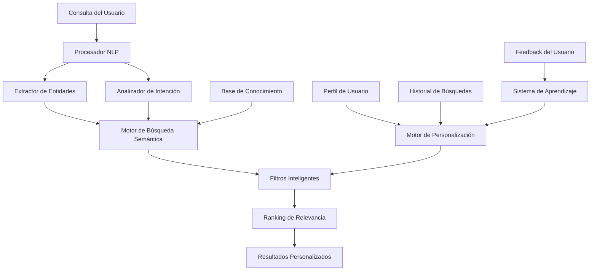

# Sistema de Filtros Inteligentes para SubvencionesAI

## 🎯 Objetivo
Implementar un sistema avanzado de filtros que utilice NLP, búsqueda semántica y perfiles de usuario para proporcionar resultados altamente relevantes y personalizados.

## 🧠 Arquitectura del Sistema



## 🔍 Componentes del Sistema

### 1. Procesador de Lenguaje Natural (NLP)

#### 1.1 Extractor de Entidades
```javascript
class EntityExtractor {
  constructor() {
    this.patterns = {
      // Sectores empresariales
      sectors: [
        /\b(tecnolog[íi]a|tech|digital|software|hardware)\b/gi,
        /\b(turismo|hostelería|restauración)\b/gi,
        /\b(agricultura|agrícola|ganadería|rural)\b/gi,
        /\b(industria|industrial|manufactura|producción)\b/gi,
        /\b(energía|renovables|sostenible|verde)\b/gi,
        /\b(salud|sanitario|médico|farmacéutico)\b/gi,
        /\b(educación|formación|capacitación)\b/gi,
        /\b(comercio|retail|venta|distribución)\b/gi
      ],
      
      // Tamaños de empresa
      companySize: [
        /\b(micro|microempresa|autónomo|freelance)\b/gi,
        /\b(pequeña|pyme|pmi|startup)\b/gi,
        /\b(mediana|empresa mediana)\b/gi,
        /\b(grande|gran empresa|multinacional)\b/gi
      ],
      
      // Ubicaciones geográficas
      locations: [
        /\b(madrid|madrileño|comunidad de madrid)\b/gi,
        /\b(barcelona|cataluña|catalunya|catalán)\b/gi,
        /\b(valencia|valenciano|comunidad valenciana)\b/gi,
        /\b(sevilla|andalucía|andaluz)\b/gi,
        /\b(bilbao|país vasco|euskadi|vasco)\b/gi,
        /\b(nacional|españa|español|estatal)\b/gi,
        /\b(europeo|europa|ue|unión europea)\b/gi,
        /\b(internacional|global|mundial)\b/gi
      ],
      
      // Tipos de financiación
      fundingTypes: [
        /\b(subvención|ayuda|beca|premio)\b/gi,
        /\b(préstamo|crédito|financiación|inversión)\b/gi,
        /\b(incentivo|desgravación|bonificación)\b/gi,
        /\b(concurso|convocatoria|licitación)\b/gi
      ],
      
      // Rangos de importe
      amounts: [
        /\b(\d{1,3}(?:[.,]\d{3})*(?:[.,]\d{2})?)\s*(?:€|euros?)\b/gi,
        /\b(?:hasta|máximo|max|límite)\s*(\d+)\s*(?:€|euros?|mil|k)\b/gi,
        /\b(?:desde|mínimo|min)\s*(\d+)\s*(?:€|euros?|mil|k)\b/gi
      ],
      
      // Fechas y plazos
      dates: [
        /\b(\d{1,2})[\/\-](\d{1,2})[\/\-](\d{4})\b/g,
        /\b(enero|febrero|marzo|abril|mayo|junio|julio|agosto|septiembre|octubre|noviembre|diciembre)\s+(\d{4})\b/gi,
        /\b(?:plazo|deadline|fecha límite|vence|cierra)\b/gi
      ],
      
      // Objetivos y propósitos
      purposes: [
        /\b(innovación|i\+d|investigación|desarrollo)\b/gi,
        /\b(digitalización|transformación digital|industria 4\.0)\b/gi,
        /\b(sostenibilidad|medio ambiente|ecológico|verde)\b/gi,
        /\b(internacionalización|exportación|mercados exteriores)\b/gi,
        /\b(empleo|contratación|recursos humanos|formación)\b/gi,
        /\b(competitividad|productividad|eficiencia)\b/gi
      ]
    };
  }
  
  extractEntities(text) {
    const entities = {
      sectors: [],
      companySize: [],
      locations: [],
      fundingTypes: [],
      amounts: [],
      dates: [],
      purposes: [],
      keywords: []
    };
    
    // Extraer entidades por categoría
    Object.keys(this.patterns).forEach(category => {
      this.patterns[category].forEach(pattern => {
        const matches = text.match(pattern);
        if (matches) {
          entities[category].push(...matches.map(m => m.toLowerCase().trim()));
        }
      });
    });
    
    // Eliminar duplicados
    Object.keys(entities).forEach(key => {
      entities[key] = [...new Set(entities[key])];
    });
    
    // Extraer keywords generales
    entities.keywords = this.extractKeywords(text);
    
    return entities;
  }
  
  extractKeywords(text) {
    // Palabras vacías en español
    const stopWords = new Set([
      'el', 'la', 'de', 'que', 'y', 'a', 'en', 'un', 'es', 'se', 'no', 'te', 'lo', 'le',
      'da', 'su', 'por', 'son', 'con', 'para', 'al', 'del', 'los', 'las', 'una', 'como',
      'pero', 'sus', 'le', 'ya', 'o', 'porque', 'cuando', 'muy', 'sin', 'sobre', 'también',
      'me', 'hasta', 'hay', 'donde', 'quien', 'desde', 'todos', 'durante', 'todos'
    ]);
    
    return text
      .toLowerCase()
      .replace(/[^\w\sáéíóúñü]/g, ' ')
      .split(/\s+/)
      .filter(word => word.length > 2 && !stopWords.has(word))
      .reduce((acc, word) => {
        acc[word] = (acc[word] || 0) + 1;
        return acc;
      }, {});
  }
}
```

#### 1.2 Analizador de Intención
```javascript
class IntentAnalyzer {
  constructor() {
    this.intents = {
      SEARCH_GRANTS: {
        patterns: [
          /buscar\s+subvenciones?/gi,
          /encontrar\s+ayudas?/gi,
          /necesito\s+financiación/gi,
          /quiero\s+solicitar/gi
        ],
        confidence: 0.8
      },
      
      FILTER_BY_SECTOR: {
        patterns: [
          /subvenciones?\s+para\s+\w+/gi,
          /ayudas?\s+sector\s+\w+/gi,
          /financiación\s+\w+/gi
        ],
        confidence: 0.7
      },
      
      FILTER_BY_AMOUNT: {
        patterns: [
          /hasta\s+\d+/gi,
          /máximo\s+\d+/gi,
          /entre\s+\d+\s+y\s+\d+/gi
        ],
        confidence: 0.9
      },
      
      FILTER_BY_LOCATION: {
        patterns: [
          /en\s+\w+/gi,
          /para\s+\w+/gi,
          /comunidad\s+de\s+\w+/gi
        ],
        confidence: 0.6
      },
      
      URGENT_SEARCH: {
        patterns: [
          /urgente/gi,
          /rápido/gi,
          /pronto/gi,
          /inmediato/gi
        ],
        confidence: 0.8
      }
    };
  }
  
  analyzeIntent(text, entities) {
    const detectedIntents = [];
    
    Object.keys(this.intents).forEach(intentName => {
      const intent = this.intents[intentName];
      let confidence = 0;
      
      intent.patterns.forEach(pattern => {
        const matches = text.match(pattern);
        if (matches) {
          confidence = Math.max(confidence, intent.confidence);
        }
      });
      
      // Ajustar confianza basada en entidades extraídas
      if (intentName === 'FILTER_BY_SECTOR' && entities.sectors.length > 0) {
        confidence += 0.2;
      }
      if (intentName === 'FILTER_BY_AMOUNT' && entities.amounts.length > 0) {
        confidence += 0.2;
      }
      if (intentName === 'FILTER_BY_LOCATION' && entities.locations.length > 0) {
        confidence += 0.2;
      }
      
      if (confidence > 0.5) {
        detectedIntents.push({
          intent: intentName,
          confidence: Math.min(confidence, 1.0)
        });
      }
    });
    
    return detectedIntents.sort((a, b) => b.confidence - a.confidence);
  }
}
```

### 2. Motor de Búsqueda Semántica

#### 2.1 Embeddings y Similitud
```javascript
class SemanticSearchEngine {
  constructor() {
    this.embeddings = new Map();
    this.synonyms = {
      'tecnología': ['tech', 'digital', 'informática', 'software', 'hardware'],
      'innovación': ['i+d', 'investigación', 'desarrollo', 'invención'],
      'pyme': ['pequeña empresa', 'mediana empresa', 'pmi', 'startup'],
      'sostenibilidad': ['medio ambiente', 'ecológico', 'verde', 'renovable'],
      'digitalización': ['transformación digital', 'industria 4.0', 'automatización']
    };
  }
  
  async generateEmbedding(text) {
    // Simulación de embedding - en producción usar OpenAI, Cohere, etc.
    const words = text.toLowerCase().split(/\s+/);
    const vector = new Array(300).fill(0);
    
    words.forEach((word, index) => {
      const hash = this.simpleHash(word);
      vector[hash % 300] += 1;
    });
    
    // Normalizar vector
    const magnitude = Math.sqrt(vector.reduce((sum, val) => sum + val * val, 0));
    return vector.map(val => val / magnitude);
  }
  
  simpleHash(str) {
    let hash = 0;
    for (let i = 0; i < str.length; i++) {
      const char = str.charCodeAt(i);
      hash = ((hash << 5) - hash) + char;
      hash = hash & hash; // Convert to 32-bit integer
    }
    return Math.abs(hash);
  }
  
  cosineSimilarity(vectorA, vectorB) {
    const dotProduct = vectorA.reduce((sum, a, i) => sum + a * vectorB[i], 0);
    const magnitudeA = Math.sqrt(vectorA.reduce((sum, a) => sum + a * a, 0));
    const magnitudeB = Math.sqrt(vectorB.reduce((sum, b) => sum + b * b, 0));
    
    return dotProduct / (magnitudeA * magnitudeB);
  }
  
  expandQuery(query) {
    const expandedTerms = new Set([query]);
    
    // Agregar sinónimos
    Object.keys(this.synonyms).forEach(term => {
      if (query.toLowerCase().includes(term)) {
        this.synonyms[term].forEach(synonym => {
          expandedTerms.add(synonym);
        });
      }
    });
    
    return Array.from(expandedTerms);
  }
  
  async searchSimilar(query, documents, threshold = 0.7) {
    const queryEmbedding = await this.generateEmbedding(query);
    const expandedQuery = this.expandQuery(query);
    
    const results = [];
    
    for (const doc of documents) {
      const docText = `${doc.title} ${doc.description} ${doc.sector} ${doc.keywords?.join(' ') || ''}`;
      const docEmbedding = await this.generateEmbedding(docText);
      
      let similarity = this.cosineSimilarity(queryEmbedding, docEmbedding);
      
      // Boost por términos expandidos
      expandedQuery.forEach(term => {
        if (docText.toLowerCase().includes(term.toLowerCase())) {
          similarity += 0.1;
        }
      });
      
      if (similarity >= threshold) {
        results.push({
          document: doc,
          similarity: Math.min(similarity, 1.0),
          matchedTerms: expandedQuery.filter(term => 
            docText.toLowerCase().includes(term.toLowerCase())
          )
        });
      }
    }
    
    return results.sort((a, b) => b.similarity - a.similarity);
  }
}
```

### 3. Motor de Personalización

#### 3.1 Perfil de Usuario
```javascript
class UserProfile {
  constructor(userId) {
    this.userId = userId;
    this.preferences = {
      sectors: [],
      companySize: null,
      location: null,
      amountRange: { min: 0, max: Infinity },
      urgencyPreference: 'medium', // low, medium, high
      riskTolerance: 'medium', // low, medium, high
      previousApplications: [],
      successfulGrants: [],
      rejectedGrants: []
    };
    this.searchHistory = [];
    this.interactionHistory = [];
    this.learningWeights = {
      sector: 1.0,
      amount: 0.8,
      location: 0.6,
      deadline: 0.9,
      complexity: 0.7
    };
  }
  
  updateFromSearch(searchCriteria, results, userFeedback) {
    // Actualizar historial de búsqueda
    this.searchHistory.push({
      timestamp: new Date(),
      criteria: searchCriteria,
      resultsCount: results.length,
      feedback: userFeedback
    });
    
    // Aprender de las preferencias implícitas
    if (userFeedback && userFeedback.clickedResults) {
      userFeedback.clickedResults.forEach(result => {
        // Incrementar peso de sectores clickeados
        if (result.sector && !this.preferences.sectors.includes(result.sector)) {
          this.preferences.sectors.push(result.sector);
        }
        
        // Ajustar rango de importes preferido
        if (result.amount_max) {
          this.adjustAmountPreference(result.amount_max);
        }
      });
    }
    
    // Ajustar pesos de aprendizaje
    this.adjustLearningWeights(userFeedback);
  }
  
  adjustAmountPreference(amount) {
    const currentRange = this.preferences.amountRange;
    
    // Expandir rango si el importe está fuera
    if (amount > currentRange.max) {
      currentRange.max = Math.min(amount * 1.2, amount + 50000);
    }
    if (amount < currentRange.min) {
      currentRange.min = Math.max(amount * 0.8, amount - 10000);
    }
  }
  
  adjustLearningWeights(feedback) {
    if (!feedback) return;
    
    // Si el usuario encontró resultados relevantes, mantener pesos
    if (feedback.relevanceScore > 0.7) {
      return;
    }
    
    // Si no encontró resultados relevantes, ajustar pesos
    if (feedback.relevanceScore < 0.3) {
      // Reducir peso de criterios que no funcionaron
      Object.keys(this.learningWeights).forEach(key => {
        this.learningWeights[key] *= 0.9;
      });
    }
  }
  
  getPersonalizationScore(grant) {
    let score = 0;
    let totalWeight = 0;
    
    // Puntuación por sector
    if (this.preferences.sectors.includes(grant.sector)) {
      score += this.learningWeights.sector * 2;
    }
    totalWeight += this.learningWeights.sector;
    
    // Puntuación por rango de importe
    const amount = grant.amount_max || grant.amount_min || 0;
    if (amount >= this.preferences.amountRange.min && 
        amount <= this.preferences.amountRange.max) {
      score += this.learningWeights.amount * 1.5;
    }
    totalWeight += this.learningWeights.amount;
    
    // Puntuación por ubicación
    if (this.preferences.location && 
        grant.geographic_scope?.includes(this.preferences.location)) {
      score += this.learningWeights.location * 1.2;
    }
    totalWeight += this.learningWeights.location;
    
    // Puntuación por urgencia
    const daysUntilDeadline = this.getDaysUntilDeadline(grant.deadline_date);
    const urgencyScore = this.getUrgencyScore(daysUntilDeadline);
    score += this.learningWeights.deadline * urgencyScore;
    totalWeight += this.learningWeights.deadline;
    
    return totalWeight > 0 ? score / totalWeight : 0;
  }
  
  getDaysUntilDeadline(deadlineDate) {
    if (!deadlineDate) return Infinity;
    const deadline = new Date(deadlineDate);
    const now = new Date();
    return (deadline - now) / (1000 * 60 * 60 * 24);
  }
  
  getUrgencyScore(daysUntilDeadline) {
    if (daysUntilDeadline === Infinity) return 0.5;
    
    switch (this.preferences.urgencyPreference) {
      case 'high':
        return daysUntilDeadline <= 30 ? 2.0 : 0.5;
      case 'medium':
        return daysUntilDeadline <= 60 ? 1.5 : 1.0;
      case 'low':
        return daysUntilDeadline >= 90 ? 1.5 : 1.0;
      default:
        return 1.0;
    }
  }
}
```

### 4. Sistema de Filtros Inteligentes

#### 4.1 Filtro Principal
```javascript
class IntelligentFilterSystem {
  constructor() {
    this.entityExtractor = new EntityExtractor();
    this.intentAnalyzer = new IntentAnalyzer();
    this.semanticSearch = new SemanticSearchEngine();
    this.userProfiles = new Map();
  }
  
  async processQuery(userId, query, documents, options = {}) {
    // 1. Extraer entidades y analizar intención
    const entities = this.entityExtractor.extractEntities(query);
    const intents = this.intentAnalyzer.analyzeIntent(query, entities);
    
    // 2. Obtener perfil de usuario
    let userProfile = this.userProfiles.get(userId);
    if (!userProfile) {
      userProfile = new UserProfile(userId);
      this.userProfiles.set(userId, userProfile);
    }
    
    // 3. Aplicar filtros básicos
    let filteredDocuments = this.applyBasicFilters(documents, entities, options);
    
    // 4. Búsqueda semántica
    const semanticResults = await this.semanticSearch.searchSimilar(
      query, 
      filteredDocuments, 
      options.semanticThreshold || 0.6
    );
    
    // 5. Aplicar personalización
    const personalizedResults = this.applyPersonalization(
      semanticResults, 
      userProfile, 
      intents
    );
    
    // 6. Ranking final
    const rankedResults = this.calculateFinalRanking(
      personalizedResults, 
      entities, 
      intents, 
      userProfile
    );
    
    return {
      results: rankedResults,
      metadata: {
        totalFound: rankedResults.length,
        entities: entities,
        intents: intents,
        processingTime: Date.now() - startTime,
        filters: this.getAppliedFilters(entities, options)
      }
    };
  }
  
  applyBasicFilters(documents, entities, options) {
    return documents.filter(doc => {
      // Filtro por sector
      if (entities.sectors.length > 0) {
        const docSector = doc.sector?.toLowerCase() || '';
        const hasMatchingSector = entities.sectors.some(sector => 
          docSector.includes(sector.toLowerCase())
        );
        if (!hasMatchingSector) return false;
      }
      
      // Filtro por ubicación
      if (entities.locations.length > 0) {
        const docLocation = doc.geographic_scope?.toLowerCase() || '';
        const hasMatchingLocation = entities.locations.some(location => 
          docLocation.includes(location.toLowerCase()) || 
          location.toLowerCase().includes('nacional') ||
          location.toLowerCase().includes('europa')
        );
        if (!hasMatchingLocation) return false;
      }
      
      // Filtro por importe
      if (entities.amounts.length > 0) {
        const docAmount = doc.amount_max || doc.amount_min || 0;
        // Lógica de filtrado por importe basada en entidades extraídas
        // Implementar según necesidades específicas
      }
      
      // Filtro por fecha límite
      if (options.maxDaysUntilDeadline) {
        const daysUntilDeadline = this.getDaysUntilDeadline(doc.deadline_date);
        if (daysUntilDeadline > options.maxDaysUntilDeadline) {
          return false;
        }
      }
      
      return true;
    });
  }
  
  applyPersonalization(semanticResults, userProfile, intents) {
    return semanticResults.map(result => {
      const personalizationScore = userProfile.getPersonalizationScore(result.document);
      
      // Ajustar puntuación basada en intenciones
      let intentBoost = 0;
      intents.forEach(intent => {
        switch (intent.intent) {
          case 'URGENT_SEARCH':
            const daysUntilDeadline = userProfile.getDaysUntilDeadline(result.document.deadline_date);
            if (daysUntilDeadline <= 30) {
              intentBoost += 0.3 * intent.confidence;
            }
            break;
          case 'FILTER_BY_AMOUNT':
            // Boost si el documento coincide con rangos de importe mencionados
            intentBoost += 0.2 * intent.confidence;
            break;
        }
      });
      
      return {
        ...result,
        personalizationScore,
        intentBoost,
        combinedScore: result.similarity + personalizationScore + intentBoost
      };
    });
  }
  
  calculateFinalRanking(personalizedResults, entities, intents, userProfile) {
    return personalizedResults
      .sort((a, b) => b.combinedScore - a.combinedScore)
      .map((result, index) => ({
        ...result,
        rank: index + 1,
        explanation: this.generateExplanation(result, entities, intents)
      }));
  }
  
  generateExplanation(result, entities, intents) {
    const explanations = [];
    
    if (result.similarity > 0.8) {
      explanations.push('Alta similitud semántica con tu búsqueda');
    }
    
    if (result.personalizationScore > 1.0) {
      explanations.push('Coincide con tu perfil de preferencias');
    }
    
    if (result.intentBoost > 0.2) {
      explanations.push('Relevante para tu intención de búsqueda');
    }
    
    if (result.matchedTerms && result.matchedTerms.length > 0) {
      explanations.push(`Coincide con: ${result.matchedTerms.join(', ')}`);
    }
    
    return explanations.join(' • ');
  }
  
  getDaysUntilDeadline(deadlineDate) {
    if (!deadlineDate) return Infinity;
    const deadline = new Date(deadlineDate);
    const now = new Date();
    return (deadline - now) / (1000 * 60 * 60 * 24);
  }
  
  getAppliedFilters(entities, options) {
    const filters = [];
    
    if (entities.sectors.length > 0) {
      filters.push({ type: 'sector', values: entities.sectors });
    }
    
    if (entities.locations.length > 0) {
      filters.push({ type: 'location', values: entities.locations });
    }
    
    if (entities.amounts.length > 0) {
      filters.push({ type: 'amount', values: entities.amounts });
    }
    
    if (options.maxDaysUntilDeadline) {
      filters.push({ type: 'deadline', value: options.maxDaysUntilDeadline });
    }
    
    return filters;
  }
}
```

## 🔧 Integración con el Frontend

### Componente de Búsqueda Inteligente
```javascript
// Componente React para búsqueda inteligente
const IntelligentSearch = () => {
  const [query, setQuery] = useState('');
  const [results, setResults] = useState([]);
  const [isLoading, setIsLoading] = useState(false);
  const [suggestions, setSuggestions] = useState([]);
  const [appliedFilters, setAppliedFilters] = useState([]);
  
  const intelligentFilter = new IntelligentFilterSystem();
  
  const handleSearch = async () => {
    if (!query.trim()) return;
    
    setIsLoading(true);
    try {
      // Obtener documentos de Supabase
      const documents = await fetchGrantsFromSupabase();
      
      // Procesar con filtros inteligentes
      const result = await intelligentFilter.processQuery(
        'user-123', // ID del usuario actual
        query,
        documents,
        {
          semanticThreshold: 0.6,
          maxDaysUntilDeadline: 90
        }
      );
      
      setResults(result.results);
      setAppliedFilters(result.metadata.filters);
      
      // Guardar búsqueda en historial
      await saveSearchToHistory({
        query,
        results: result.results.length,
        entities: result.metadata.entities,
        timestamp: new Date()
      });
      
    } catch (error) {
      console.error('Error en búsqueda inteligente:', error);
    } finally {
      setIsLoading(false);
    }
  };
  
  const handleQueryChange = async (newQuery) => {
    setQuery(newQuery);
    
    // Generar sugerencias en tiempo real
    if (newQuery.length > 2) {
      const entities = intelligentFilter.entityExtractor.extractEntities(newQuery);
      const newSuggestions = generateSuggestions(entities);
      setSuggestions(newSuggestions);
    } else {
      setSuggestions([]);
    }
  };
  
  const generateSuggestions = (entities) => {
    const suggestions = [];
    
    // Sugerencias basadas en sectores detectados
    entities.sectors.forEach(sector => {
      suggestions.push({
        type: 'sector',
        text: `Subvenciones para ${sector}`,
        action: () => setQuery(`subvenciones ${sector}`)
      });
    });
    
    // Sugerencias basadas en ubicaciones
    entities.locations.forEach(location => {
      suggestions.push({
        type: 'location',
        text: `Ayudas en ${location}`,
        action: () => setQuery(`${query} en ${location}`)
      });
    });
    
    return suggestions.slice(0, 5);
  };
  
  return (
    <div className="intelligent-search">
      <div className="search-input-container">
        <input
          type="text"
          value={query}
          onChange={(e) => handleQueryChange(e.target.value)}
          placeholder="Describe qué tipo de subvención buscas..."
          className="search-input"
        />
        <button onClick={handleSearch} disabled={isLoading}>
          {isLoading ? 'Buscando...' : 'Buscar'}
        </button>
      </div>
      
      {suggestions.length > 0 && (
        <div className="suggestions">
          {suggestions.map((suggestion, index) => (
            <button
              key={index}
              className={`suggestion suggestion-${suggestion.type}`}
              onClick={suggestion.action}
            >
              {suggestion.text}
            </button>
          ))}
        </div>
      )}
      
      {appliedFilters.length > 0 && (
        <div className="applied-filters">
          <h4>Filtros aplicados:</h4>
          {appliedFilters.map((filter, index) => (
            <span key={index} className="filter-tag">
              {filter.type}: {Array.isArray(filter.values) ? filter.values.join(', ') : filter.value}
            </span>
          ))}
        </div>
      )}
      
      <div className="search-results">
        {results.map((result, index) => (
          <div key={index} className="result-card">
            <h3>{result.document.title}</h3>
            <p>{result.document.description}</p>
            <div className="result-metadata">
              <span className="similarity-score">
                Relevancia: {(result.similarity * 100).toFixed(0)}%
              </span>
              <span className="personalization-score">
                Personalización: {(result.personalizationScore * 100).toFixed(0)}%
              </span>
            </div>
            <p className="explanation">{result.explanation}</p>
          </div>
        ))}
      </div>
    </div>
  );
};
```

## 📊 Métricas y Evaluación

### Sistema de Métricas
```javascript
class FilterMetrics {
  constructor() {
    this.metrics = {
      searchAccuracy: [],
      userSatisfaction: [],
      responseTime: [],
      filterEffectiveness: []
    };
  }
  
  recordSearch(searchData) {
    const {
      query,
      results,
      userFeedback,
      processingTime,
      appliedFilters
    } = searchData;
    
    // Precisión de búsqueda
    const relevantResults = results.filter(r => r.combinedScore > 0.7).length;
    const accuracy = relevantResults / results.length;
    this.metrics.searchAccuracy.push(accuracy);
    
    // Tiempo de respuesta
    this.metrics.responseTime.push(processingTime);
    
    // Satisfacción del usuario (basada en clics y feedback)
    if (userFeedback) {
      this.metrics.userSatisfaction.push(userFeedback.satisfactionScore);
    }
    
    // Efectividad de filtros
    const filterEffectiveness = this.calculateFilterEffectiveness(
      appliedFilters, 
      results, 
      userFeedback
    );
    this.metrics.filterEffectiveness.push(filterEffectiveness);
  }
  
  calculateFilterEffectiveness(filters, results, feedback) {
    if (!feedback || !feedback.clickedResults) return 0.5;
    
    const clickedResults = feedback.clickedResults;
    const totalClicks = clickedResults.length;
    
    if (totalClicks === 0) return 0;
    
    // Calcular qué porcentaje de resultados clickeados coinciden con filtros
    let matchingClicks = 0;
    
    clickedResults.forEach(result => {
      filters.forEach(filter => {
        switch (filter.type) {
          case 'sector':
            if (filter.values.some(v => result.sector?.toLowerCase().includes(v.toLowerCase()))) {
              matchingClicks++;
            }
            break;
          case 'location':
            if (filter.values.some(v => result.geographic_scope?.toLowerCase().includes(v.toLowerCase()))) {
              matchingClicks++;
            }
            break;
        }
      });
    });
    
    return matchingClicks / (totalClicks * filters.length);
  }
  
  getAverageMetrics() {
    return {
      averageAccuracy: this.average(this.metrics.searchAccuracy),
      averageSatisfaction: this.average(this.metrics.userSatisfaction),
      averageResponseTime: this.average(this.metrics.responseTime),
      averageFilterEffectiveness: this.average(this.metrics.filterEffectiveness)
    };
  }
  
  average(array) {
    return array.length > 0 ? array.reduce((a, b) => a + b, 0) / array.length : 0;
  }
}
```

## 🚀 Plan de Implementación

### Fase 1: Fundamentos (Semana 1)
- [ ] Implementar EntityExtractor básico
- [ ] Crear IntentAnalyzer simple
- [ ] Desarrollar UserProfile básico
- [ ] Integrar con frontend existente

### Fase 2: Búsqueda Semántica (Semana 2)
- [ ] Implementar SemanticSearchEngine
- [ ] Integrar embeddings (OpenAI/Cohere)
- [ ] Desarrollar sistema de sinónimos
- [ ] Optimizar algoritmos de similitud

### Fase 3: Personalización (Semana 3)
- [ ] Completar sistema de perfiles de usuario
- [ ] Implementar aprendizaje automático
- [ ] Desarrollar sistema de feedback
- [ ] Crear dashboard de personalización

### Fase 4: Optimización (Semana 4)
- [ ] Implementar sistema de métricas
- [ ] Optimizar rendimiento
- [ ] Ajustar algoritmos basado en datos
- [ ] Documentar y entrenar usuarios

## 🎯 Próximos Pasos

1. [ ] Aprobar diseño del sistema de filtros inteligentes
2. [ ] Comenzar implementación de EntityExtractor
3. [ ] Configurar integración con API de embeddings
4. [ ] Desarrollar interfaz de usuario para filtros
5. [ ] Establecer métricas de evaluación

**¿Proceder con la implementación del sistema de filtros inteligentes?**