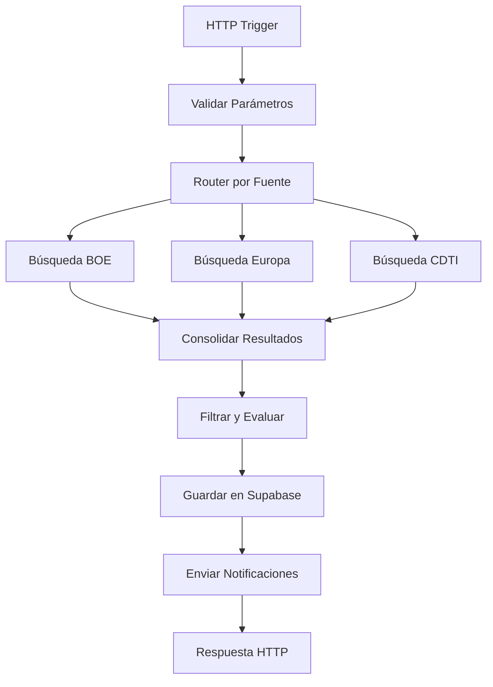
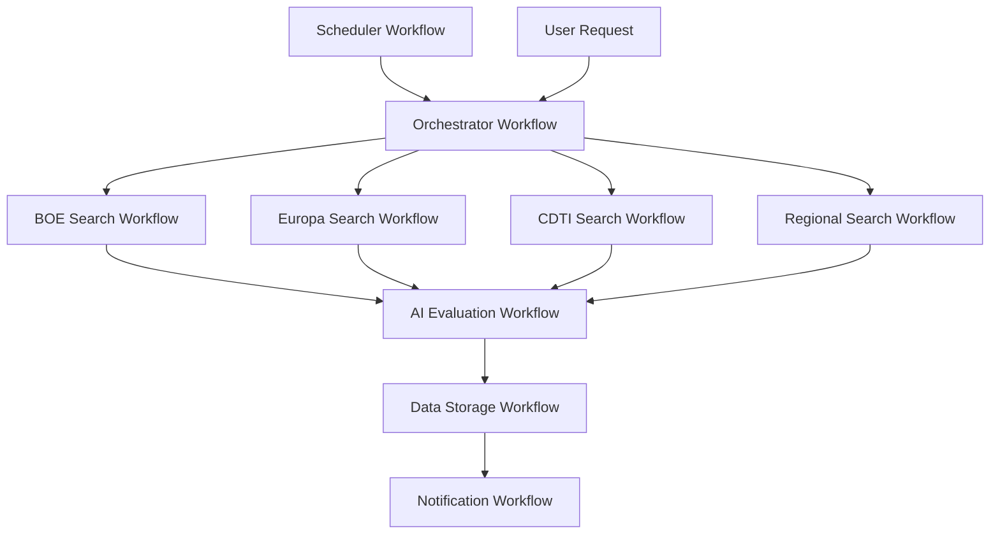

# Arquitectura de Workflows n8n para SubvencionesAI

## 🎯 Decisión Crítica: Macro-Workflow vs Workflows Especializados

### 📊 Análisis Comparativo

| Aspecto | Macro-Workflow | Workflows Especializados |
|---------|----------------|---------------------------|
| **Complejidad inicial** | 🟡 Media | 🔴 Alta |
| **Mantenimiento** | 🟢 Fácil | 🟡 Moderado |
| **Escalabilidad** | 🟡 Limitada | 🟢 Excelente |
| **Rendimiento** | 🟡 Moderado | 🟢 Óptimo |
| **Debugging** | 🔴 Difícil | 🟢 Fácil |
| **Paralelización** | 🔴 Limitada | 🟢 Nativa |
| **Especialización** | 🔴 Baja | 🟢 Alta |
| **Tiempo de desarrollo** | 🟢 Rápido | 🟡 Moderado |

## 🏗️ Propuesta: Arquitectura Híbrida Evolutiva

### Fase 1: Macro-Workflow (MVP)
**Objetivo**: Validar el concepto y obtener feedback rápido



### Fase 2: Workflows Especializados (Escalabilidad)
**Objetivo**: Optimizar rendimiento y especializar funciones



## 📋 Especificación Detallada

### 1. Macro-Workflow Principal (Fase 1)

#### Nombre: `subvenciones-search-master`

#### Parámetros de Entrada:
```json
{
  "searchCriteria": {
    "keywords": ["digitalización", "PYME"],
    "sectors": ["tecnología", "innovación"],
    "regions": ["Madrid", "Nacional"],
    "amountRange": {
      "min": 10000,
      "max": 100000
    },
    "companySize": "PEQUEÑA",
    "urgencyThreshold": 30
  },
  "sources": ["BOE", "EUROPA", "CDTI"],
  "userProfile": {
    "id": "user-123",
    "companyProfile": {...}
  },
  "options": {
    "maxResults": 50,
    "includeExpired": false,
    "aiEvaluation": true
  }
}
```

#### Nodos del Workflow:

1. **HTTP Trigger**
   - Endpoint: `/webhook/search-grants`
   - Método: POST
   - Autenticación: API Key

2. **Validate Input**
   ```javascript
   // Validar estructura de parámetros
   if (!$json.searchCriteria) {
     throw new Error('searchCriteria is required');
   }
   
   // Establecer valores por defecto
   const criteria = {
     maxResults: 50,
     includeExpired: false,
     aiEvaluation: true,
     ...($json.options || {})
   };
   
   return {
     ...($json),
     options: criteria,
     timestamp: new Date().toISOString(),
     executionId: $execution.id
   };
   ```

3. **Source Router (Switch)**
   - Condiciones basadas en `sources` array
   - Rutas paralelas para cada fuente

4. **BOE Search Node**
   ```javascript
   const searchParams = {
     q: $json.searchCriteria.keywords.join(' '),
     sector: $json.searchCriteria.sectors,
     fechaDesde: new Date().toISOString().split('T')[0],
     formato: 'json'
   };
   
   const response = await this.helpers.httpRequest({
     method: 'GET',
     url: `${process.env.BOE_API_URL}/buscar`,
     qs: searchParams,
     headers: {
       'Accept': 'application/json'
     }
   });
   
   return response.resultados.map(item => ({
     ...item,
     source: 'BOE',
     sourceId: item.id,
     processedAt: new Date().toISOString()
   }));
   ```

5. **Europa Search Node**
   ```javascript
   const searchParams = {
     text: $json.searchCriteria.keywords.join(' '),
     programmePeriod: '2021-2027',
     status: 'Open',
     orderBy: 'SubmissionDeadlineDate'
   };
   
   const response = await this.helpers.httpRequest({
     method: 'GET',
     url: `${process.env.EUROPA_API_URL}/opportunities`,
     qs: searchParams,
     headers: {
       'Accept': 'application/json'
     }
   });
   
   return response.opportunities.map(item => ({
     ...item,
     source: 'EUROPA',
     sourceId: item.identifier,
     processedAt: new Date().toISOString()
   }));
   ```

6. **CDTI Search Node**
   ```javascript
   const searchParams = {
     texto: $json.searchCriteria.keywords.join(' '),
     sector: $json.searchCriteria.sectors,
     estado: 'abierta'
   };
   
   const response = await this.helpers.httpRequest({
     method: 'GET',
     url: `${process.env.CDTI_API_URL}/convocatorias`,
     qs: searchParams,
     headers: {
       'Accept': 'application/json'
     }
   });
   
   return response.convocatorias.map(item => ({
     ...item,
     source: 'CDTI',
     sourceId: item.id,
     processedAt: new Date().toISOString()
   }));
   ```

7. **Merge Results**
   ```javascript
   const allResults = [];
   
   // Combinar resultados de todas las fuentes
   if ($input.first()) {
     allResults.push(...$input.first().json);
   }
   
   // Normalizar estructura de datos
   const normalizedResults = allResults.map(grant => ({
     title: grant.titulo || grant.title || grant.nombre,
     description: grant.descripcion || grant.description || grant.resumen,
     source: grant.source,
     sourceId: grant.sourceId,
     sourceUrl: grant.url || grant.enlace,
     amount_min: grant.importeMinimo || grant.minAmount || 0,
     amount_max: grant.importeMaximo || grant.maxAmount || 0,
     deadline_date: grant.fechaCierre || grant.deadline || grant.fechaLimite,
     publication_date: grant.fechaPublicacion || grant.publishDate,
     sector: grant.sector || grant.area,
     geographic_scope: grant.ambitoGeografico || 'NACIONAL',
     requirements: grant.requisitos || grant.requirements,
     keywords: extractKeywords(grant.title + ' ' + grant.description),
     processedAt: grant.processedAt
   }));
   
   return normalizedResults;
   ```

8. **Apply Filters**
   ```javascript
   const criteria = $json.searchCriteria;
   const results = $json.results || [];
   
   const filteredResults = results.filter(grant => {
     // Filtro por rango de importe
     if (criteria.amountRange) {
       const amount = grant.amount_max || grant.amount_min || 0;
       if (amount < criteria.amountRange.min || amount > criteria.amountRange.max) {
         return false;
       }
     }
     
     // Filtro por región
     if (criteria.regions && criteria.regions.length > 0) {
       const grantRegions = grant.regions || [grant.geographic_scope];
       const hasMatchingRegion = criteria.regions.some(region => 
         grantRegions.some(grantRegion => 
           grantRegion.toLowerCase().includes(region.toLowerCase())
         )
       );
       if (!hasMatchingRegion) return false;
     }
     
     // Filtro por fecha límite (urgencia)
     if (criteria.urgencyThreshold) {
       const deadline = new Date(grant.deadline_date);
       const now = new Date();
       const daysUntilDeadline = (deadline - now) / (1000 * 60 * 60 * 24);
       if (daysUntilDeadline > criteria.urgencyThreshold) {
         return false;
       }
     }
     
     return true;
   });
   
   return filteredResults;
   ```

9. **AI Evaluation (Conditional)**
   ```javascript
   if (!$json.options.aiEvaluation) {
     return $json.results.map(grant => ({
       ...grant,
       relevance_score: 5.0,
       feasibility_score: 5.0,
       overall_score: 5.0
     }));
   }
   
   const evaluatedResults = [];
   
   for (const grant of $json.results) {
     const prompt = `
     Evalúa esta subvención para el siguiente perfil de empresa:
     
     EMPRESA:
     - Tamaño: ${$json.userProfile.companyProfile.size}
     - Sector: ${$json.userProfile.companyProfile.sector}
     - Ubicación: ${$json.userProfile.companyProfile.location}
     - Empleados: ${$json.userProfile.companyProfile.employees}
     
     SUBVENCIÓN:
     - Título: ${grant.title}
     - Descripción: ${grant.description}
     - Importe: ${grant.amount_min} - ${grant.amount_max} EUR
     - Sector: ${grant.sector}
     - Requisitos: ${grant.requirements}
     
     Proporciona una evaluación en formato JSON:
     {
       "relevance_score": 0-10,
       "feasibility_score": 0-10,
       "overall_score": 0-10,
       "reasoning": "explicación breve",
       "recommendations": "recomendaciones específicas"
     }
     `;
     
     const aiResponse = await this.helpers.httpRequest({
       method: 'POST',
       url: 'https://api.openai.com/v1/chat/completions',
       headers: {
         'Authorization': `Bearer ${process.env.AI_API_KEY}`,
         'Content-Type': 'application/json'
       },
       body: {
         model: process.env.AI_MODEL_NAME || 'gpt-4',
         messages: [{
           role: 'user',
           content: prompt
         }],
         temperature: 0.3
       }
     });
     
     const evaluation = JSON.parse(aiResponse.choices[0].message.content);
     
     evaluatedResults.push({
       ...grant,
       ...evaluation,
       ai_evaluated: true,
       ai_model: process.env.AI_MODEL_NAME || 'gpt-4'
     });
   }
   
   return evaluatedResults;
   ```

10. **Save to Supabase**
    ```javascript
    const results = $json.results || [];
    const savedGrants = [];
    
    for (const grant of results) {
      const response = await this.helpers.httpRequest({
        method: 'POST',
        url: `${process.env.SUPABASE_URL}/rest/v1/grants`,
        headers: {
          'apikey': process.env.SUPABASE_ANON_KEY,
          'Authorization': `Bearer ${process.env.SUPABASE_ANON_KEY}`,
          'Content-Type': 'application/json',
          'Prefer': 'return=representation'
        },
        body: {
          ...grant,
          created_at: new Date().toISOString(),
          status: 'ACTIVE'
        }
      });
      
      savedGrants.push(response[0]);
    }
    
    return {
      totalFound: results.length,
      totalSaved: savedGrants.length,
      grants: savedGrants,
      executionId: $execution.id
    };
    ```

11. **Send Notifications**
    ```javascript
    const { grants, totalFound } = $json;
    const userProfile = $json.userProfile;
    
    if (totalFound > 0 && userProfile.notificationEnabled) {
      // Crear notificación en Supabase
      await this.helpers.httpRequest({
        method: 'POST',
        url: `${process.env.SUPABASE_URL}/rest/v1/notifications`,
        headers: {
          'apikey': process.env.SUPABASE_ANON_KEY,
          'Authorization': `Bearer ${process.env.SUPABASE_ANON_KEY}`,
          'Content-Type': 'application/json'
        },
        body: {
          user_profile_id: userProfile.id,
          type: 'NEW_GRANTS_FOUND',
          title: `${totalFound} nuevas subvenciones encontradas`,
          message: `Se han encontrado ${totalFound} subvenciones que coinciden con tus criterios de búsqueda.`,
          created_at: new Date().toISOString()
        }
      });
      
      // Enviar email si está configurado
      if (userProfile.notificationEmail) {
        // Implementar envío de email
      }
    }
    
    return {
      notificationSent: totalFound > 0,
      recipientEmail: userProfile.notificationEmail,
      grantsCount: totalFound
    };
    ```

12. **HTTP Response**
    ```javascript
    return {
      success: true,
      executionId: $execution.id,
      timestamp: new Date().toISOString(),
      results: {
        totalFound: $json.totalFound,
        totalSaved: $json.totalSaved,
        grants: $json.grants.slice(0, $json.options.maxResults),
        sources: $json.sources,
        filters: $json.searchCriteria,
        processingTime: Date.now() - new Date($json.timestamp).getTime()
      },
      notifications: {
        sent: $json.notificationSent,
        recipient: $json.recipientEmail
      }
    };
    ```

## 🔄 Evolución hacia Workflows Especializados (Fase 2)

### Ventajas de la Migración:
1. **Paralelización real**: Búsquedas simultáneas en todas las fuentes
2. **Especialización**: Cada workflow optimizado para su fuente específica
3. **Escalabilidad**: Fácil agregar nuevas fuentes
4. **Mantenimiento**: Cambios aislados por workflow
5. **Monitoreo**: Métricas específicas por fuente

### Workflows Especializados:

1. **orchestrator-workflow**: Coordinador principal
2. **boe-search-workflow**: Especializado en BOE
3. **europa-search-workflow**: Especializado en portales europeos
4. **cdti-search-workflow**: Especializado en CDTI
5. **regional-search-workflow**: Búsquedas regionales
6. **ai-evaluation-workflow**: Evaluación con IA
7. **data-storage-workflow**: Almacenamiento optimizado
8. **notification-workflow**: Sistema de notificaciones
9. **scheduler-workflow**: Búsquedas programadas

## 🎯 Recomendación Final

**Implementar arquitectura híbrida evolutiva:**

1. **Semana 1-2**: Desarrollar macro-workflow para MVP
2. **Semana 3-4**: Validar y optimizar macro-workflow
3. **Semana 5-6**: Migrar a workflows especializados
4. **Semana 7+**: Optimización y nuevas funcionalidades

Esta aproximación permite:
- ✅ Validación rápida del concepto
- ✅ Feedback temprano de usuarios
- ✅ Evolución natural hacia escalabilidad
- ✅ Minimización de riesgos
- ✅ Aprendizaje iterativo

## 📋 Próximos Pasos

1. [ ] Aprobar arquitectura propuesta
2. [ ] Configurar entorno n8n
3. [ ] Desarrollar macro-workflow MVP
4. [ ] Configurar webhooks y APIs
5. [ ] Realizar pruebas de integración
6. [ ] Planificar migración a workflows especializados

---

**Decisión requerida**: ¿Proceder con la arquitectura híbrida evolutiva propuesta?